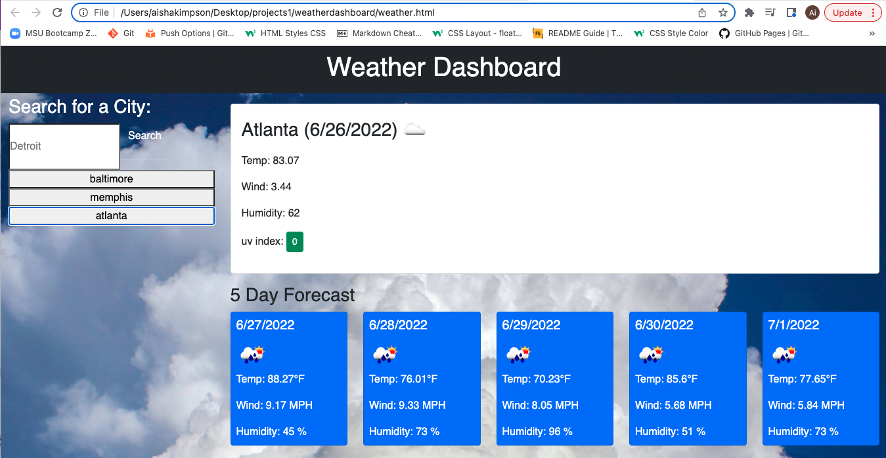

# Weather Dashboard

## Languages

HTML, CSS, and Javascript were used to create this application.

## Features

- Users can search for city names and the current weather is displayed.
- Five day weather forecast is displayed.
- Cities are added to the search history after each search.
- Weather symbols are displayed showing the weather for the current day.
- Use of https://openweathermap.org/ API's to retrieve weather data and convert latitude and longitude.

## Libraries

Bootstrap: https://getbootstrap.com/  

## 🔗 Links

This site was built using [GitHub Pages](https://akimpson.github.io/weather-dashboard/).
More of my work can be found at (https://github.com/akimpson)

## Screenshot

<!--  -->
